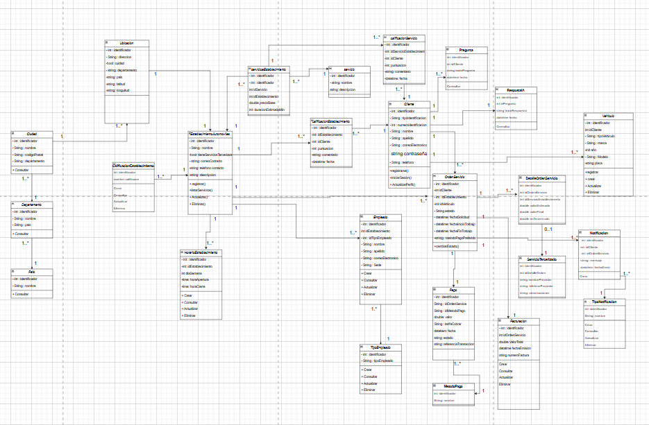

# documentacion_automoviles
# APP AUTOMOVILES

## CONTEXTO DEL PROBLEMA
Establecimientos automóviles 
Los usuarios desean una aplicación donde podemos encontrar los servicios automotriz de una manera mas eficaz, donde desean una plataforma que cuente con
1.conocer los talleres cercanos a su ubicación real
2. comparar calidad de servicio de los talleres mediante calificaciones 
3.Obtener costos de los servicios aproximados
4.Conocer los tiempos de los talleres
5. Recibir una notificación al terminar su automóvil de satisfacción 
6. Realizar pagos electrónicos 
7.obtener asistencia con la IA para resolver dudas 
Establecimientos automóviles 
Esta web nos permite poder tener una alta disponibilidad de ver que establecimientos automóviles tienes cerca a donde te encuentras, así poder escoger el mas adecuado. Y ver sus calificaciones del establecimiento, en que se especifican cada establecimiento, donde se encuentran y el horario de atención a el usuario, este sistema se enfocara en una arquitectura modular la cual nos permite tener una baja cohesión y un alto acoplamiento priorizando temas como la seguridad, escalabilidad y disponibilidad 

Despliegue: componente adoptados y desarrollados así como la ubicación de su infraestructura
Componentes: módulos lógicos del backend y fronted y sus funciones 
Paquetes : su organización será bajo capas y dependencias de controladas
Secuencias : flujo de interacción de casos de uso atípicos 

Esto lo podemos comparar con los talleres tradicionales, en el cual el usuario no sabe la recomendación de ese taller, perdida en tiempo, falta de transparencia en costos, baja confianza en esos talleres.
Esta aplicación también beneficia a los talleres automóviles ya que les permite gestionar solicitudes mas ligeramente, mejorar la experiencia del cliente, mostrar servicios,precios,disponibilidad y calificaciones, recibir pagos digitales 

# REQUISITOS 
## REQUISITOS FUNCIONALES

RF-01 – Registro de usuarios
El sistema debe permitir el registro de usuarios, solicitando datos como Tipo de identificación, número de identificación, nombre, apellido, correo, teléfono y contraseña.
RF-02 – Autenticación usuarios
El sistema debe permitir que los usuarios se autentiquen mediante correo y contraseña.
RF-03 – Gestión de perfil del usuario
El usuario debe poder actualizar su información básica como teléfono, contraseña,  tipo de identificación, correo.
 RF-04 – Registro y gestión de vehículos
El usuario debe poder registrar su vehículo con sus datos marca, modelo, placa, año.
 RF-05 – Realizar la búsqueda  de talleres por ubicación
El sistema debe permitir al usuario buscar talleres cercanos mediante GPS o con búsqueda manual para poder encontrar el taller mas cerca y la ruta también.
 RF-06 – Visualización de datos del taller
El usuario podrá ver de un taller :
•	dirección
•	teléfono
•	horarios
•	servicios ofrecidos
•	calificaciones
•	precios estimados
RF-07 – Mostrar la ruta mas óptima a un taller
El sistema debe calcular la ruta más corta o rápida hasta el taller seleccionado que el usuario desea escoger.
RF-08 – Filtros de servicios
El usuario puede filtrar talleres por:
•	tipo de servicio (aceite, frenos, suspensión,etc)
•	marca de vehículo
•	precios
•	distancia

RF-09 – Calificación de servicios
El usuario puede calificar un servicio recibido luego después de haberle llegado el mensaje en WhatsApp de confirmación de que su automóvil está listo para entregar.
RF-10 – Servicios tercerizados
El taller puede registrar que un servicio fue enviado a un proveedor externo dando la garantía de que ellos cumplan con lo dicho y la confianza.
RF-11 – Costos y cotizaciones
El sistema debe mostrar una cotización estimada por cada servicio realizado.
RF-12 – Pago electrónico
El usuario podrá tener la posibilidad de  poder pagar con:
•	PayPal
•	Bancolombia
•	tarjeta débito/crédito
•	entre muchas mas
 RF-13 – Chat IA para asistencia de usuarios
El sistema debe ofrecer un chat donde el usuario pueda consultar fallas comunes y recibir sugerencias

## requisitos no funcionales

RNF-01-Bajos costos
El sistema deberá minimizar costos de infraestructura, priorizando soluciones eficientes y escalables.
RNF-02-Mantenimimiento
El software deberá ser fácil de mantener usando patrones, modularidad y herramientas DE open source
RNF-03-seguridad
La aplicación debe cifrar las contraseñas.
RNF-04-seguridad datos
Los usuarios solo deben acceder a sus propios datos.
RNF-05-bloqueo usuarios
El sistema debe bloquear usuarios tras 3 intentos fallidos
RNF-06-mapa 
El mapa debe cargar en menos de 2 segundos.
RNF-06-disponibilidad
El sistema debe estar disponible 99% del tiempo.
RNF-06-codigo
El código debe ser modular (arquitectura por capas o microservicios).

### Importante cliente desea esto
RT-01 – Base de datos 
El sistema deberá implementar una base de datos SQL (PostgreSQL).
RT-02 – Lenguaje GoLang
El backend deberá ser desarrollado en el lenguaje GoLang.

## Diagrama de clase 

# Drivers arquitectonicos 
## Mapa de empatia
El mapa de empatia es importante porque nos ayuda a tener una clara claridad para entender que necesitan los usuarios, como elegir un taller mecanico, como quieren buscar un servicio, que problemas quieren resolver rapido, como desean pagar sus servicios, tener mas confianza en los talleres automoviles, sin tener claro este analisis, la comprension, el diseño y el desarrollo quedarian en el aire.

| Atributos de Calidad | Usuario | Empleados | Jefe | Total | Puntuación Global |
|----------------------|---------|-----------|------|-------|-------------------|
| Confiabilidad        | 2       | 1         | 2    | 5     | 4%                |
| Seguridad            | 3       | 2         | 1    | 6     | 4%                |
| Disponibilidad       | 1       | 6         | 5    | 12    | 9%                |
| Usabilidad           | 4       | 5         | 4    | 13    | 10%               |
| Trazabilidad         | 5       | 7         | 3    | 15    | 11%               |
| Eficiencia           | 6       | 3         | 9    | 18    | 13%               |
| Escalabilidad        | 8       | 4         | 6    | 18    | 13%               |
| Mantenimiento        | 7       | 8         | 8    | 23    | 17%               |
| Internacionalidad    | 9       | 9         | 7    | 25    | 19%               |
| **Totales**          | **45**  | **45**    | **45** | **135** | **100%**      |

