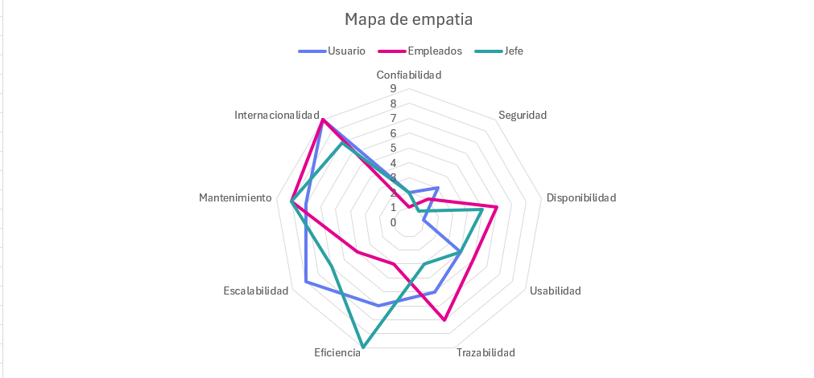
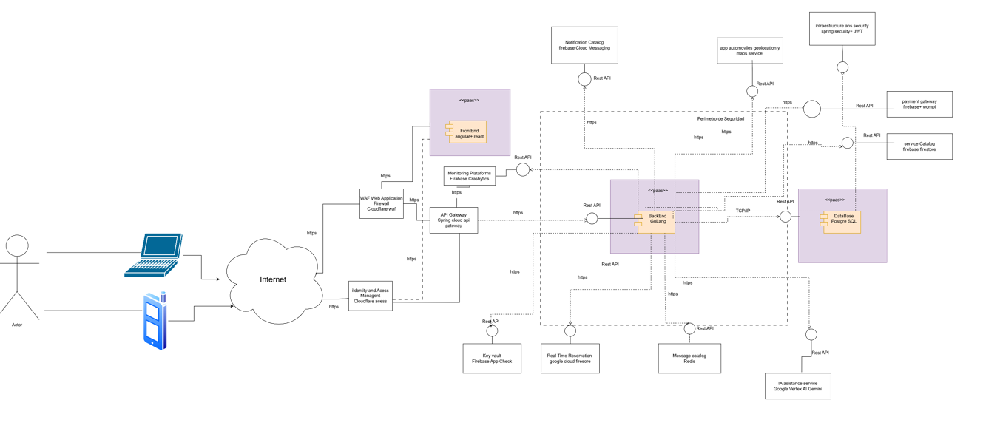

# documentacion_automoviles
# APP AUTOMOVILES

## CONTEXTO DEL PROBLEMA
Establecimientos automóviles 
Los usuarios desean una aplicación donde podemos encontrar los servicios automotriz de una manera mas eficaz, donde desean una plataforma que cuente con
1.conocer los talleres cercanos a su ubicación real
2. comparar calidad de servicio de los talleres mediante calificaciones 
3.Obtener costos de los servicios aproximados
4.Conocer los tiempos de los talleres
5. Recibir una notificación al terminar su automóvil de satisfacción 
6. Realizar pagos electrónicos 
7.obtener asistencia con la IA para resolver dudas 
Establecimientos automóviles 
Esta web nos permite poder tener una alta disponibilidad de ver que establecimientos automóviles tienes cerca a donde te encuentras, así poder escoger el mas adecuado. Y ver sus calificaciones del establecimiento, en que se especifican cada establecimiento, donde se encuentran y el horario de atención a el usuario, este sistema se enfocara en una arquitectura modular la cual nos permite tener una baja cohesión y un alto acoplamiento priorizando temas como la seguridad, escalabilidad y disponibilidad 

Despliegue: componente adoptados y desarrollados así como la ubicación de su infraestructura
Componentes: módulos lógicos del backend y fronted y sus funciones 
Paquetes : su organización será bajo capas y dependencias de controladas
Secuencias : flujo de interacción de casos de uso atípicos 

Esto lo podemos comparar con los talleres tradicionales, en el cual el usuario no sabe la recomendación de ese taller, perdida en tiempo, falta de transparencia en costos, baja confianza en esos talleres.
Esta aplicación también beneficia a los talleres automóviles ya que les permite gestionar solicitudes mas ligeramente, mejorar la experiencia del cliente, mostrar servicios,precios,disponibilidad y calificaciones, recibir pagos digitales 

# REQUISITOS 
## REQUISITOS FUNCIONALES

RF-01 – Registro de usuarios
El sistema debe permitir el registro de usuarios, solicitando datos como Tipo de identificación, número de identificación, nombre, apellido, correo, teléfono y contraseña.
RF-02 – Autenticación usuarios
El sistema debe permitir que los usuarios se autentiquen mediante correo y contraseña.
RF-03 – Gestión de perfil del usuario
El usuario debe poder actualizar su información básica como teléfono, contraseña,  tipo de identificación, correo.
 RF-04 – Registro y gestión de vehículos
El usuario debe poder registrar su vehículo con sus datos marca, modelo, placa, año.
 RF-05 – Realizar la búsqueda  de talleres por ubicación
El sistema debe permitir al usuario buscar talleres cercanos mediante GPS o con búsqueda manual para poder encontrar el taller mas cerca y la ruta también.
 RF-06 – Visualización de datos del taller
El usuario podrá ver de un taller :
•	dirección
•	teléfono
•	horarios
•	servicios ofrecidos
•	calificaciones
•	precios estimados
RF-07 – Mostrar la ruta mas óptima a un taller
El sistema debe calcular la ruta más corta o rápida hasta el taller seleccionado que el usuario desea escoger.
RF-08 – Filtros de servicios
El usuario puede filtrar talleres por:
•	tipo de servicio (aceite, frenos, suspensión,etc)
•	marca de vehículo
•	precios
•	distancia

RF-09 – Calificación de servicios
El usuario puede calificar un servicio recibido luego después de haberle llegado el mensaje en WhatsApp de confirmación de que su automóvil está listo para entregar.
RF-10 – Servicios tercerizados
El taller puede registrar que un servicio fue enviado a un proveedor externo dando la garantía de que ellos cumplan con lo dicho y la confianza.
RF-11 – Costos y cotizaciones
El sistema debe mostrar una cotización estimada por cada servicio realizado.
RF-12 – Pago electrónico
El usuario podrá tener la posibilidad de  poder pagar con:
•	PayPal
•	Bancolombia
•	tarjeta débito/crédito
•	entre muchas mas
 RF-13 – Chat IA para asistencia de usuarios
El sistema debe ofrecer un chat donde el usuario pueda consultar fallas comunes y recibir sugerencias

## requisitos no funcionales

RNF-01-Bajos costos
El sistema deberá minimizar costos de infraestructura, priorizando soluciones eficientes y escalables.
RNF-02-Mantenimimiento
El software deberá ser fácil de mantener usando patrones, modularidad y herramientas DE open source
RNF-03-seguridad
La aplicación debe cifrar las contraseñas.
RNF-04-seguridad datos
Los usuarios solo deben acceder a sus propios datos.
RNF-05-bloqueo usuarios
El sistema debe bloquear usuarios tras 3 intentos fallidos
RNF-06-mapa 
El mapa debe cargar en menos de 2 segundos.
RNF-06-disponibilidad
El sistema debe estar disponible 99% del tiempo.
RNF-06-codigo
El código debe ser modular (arquitectura por capas o microservicios).

### Importante cliente desea esto
RT-01 – Base de datos 
El sistema deberá implementar una base de datos SQL (PostgreSQL).
RT-02 – Lenguaje GoLang
El backend deberá ser desarrollado en el lenguaje GoLang.

## Diagrama de clase 

# Drivers arquitectonicos 

## Trade OFF

| Atributos de Calidad | Prioridad | 1 | 2 | 3 | 4 | 5 | 6 | 7 | 8 | 9 |
|----------------------|-----------|---|---|---|---|---|---|---|---|---|
| Disponibilidad       | 1         | 🟧 |   |   |   |   |   |   |   |   |
| Confiabilidad        | 2         |   | 🟧 |   |   |   |   |   |   |   |
| Seguridad            | 3         |   |   | 🟧 |   |   |   |   |   |   |
| Eficiencia           | 4         |   |   |   | 🟧 |   |   |   |   |   |
| Cumplimiento         | 5         |   |   |   |   | 🟧 |   |   |   |   |
| Trazabilidad         | 6         |   |   |   |   |   | 🟧 |   |   |   |
| Usabilidad           | 7         |   |   |   |   |   |   | 🟧 |   |   |
| Escalabilidad        | 8         |   |   |   |   |   |   |   | 🟧 |   |
| Internacionalidad    | 9         |   |   |   |   |   |   |   |   | 🟧 |

## Mapa de empatia
El mapa de empatia es importante porque nos ayuda a tener una clara claridad para entender que necesitan los usuarios, como elegir un taller mecanico, como quieren buscar un servicio, que problemas quieren resolver rapido, como desean pagar sus servicios, tener mas confianza en los talleres automoviles, sin tener claro este analisis, la comprension, el diseño y el desarrollo quedarian en el aire.

| Atributos de Calidad | Usuario | Empleados | Jefe | Total | Puntuación Global |
|----------------------|---------|-----------|------|-------|-------------------|
| Confiabilidad        | 2       | 1         | 2    | 5     | 4%                |
| Seguridad            | 3       | 2         | 1    | 6     | 4%                |
| Disponibilidad       | 1       | 6         | 5    | 12    | 9%                |
| Usabilidad           | 4       | 5         | 4    | 13    | 10%               |
| Trazabilidad         | 5       | 7         | 3    | 15    | 11%               |
| Eficiencia           | 6       | 3         | 9    | 18    | 13%               |
| Escalabilidad        | 8       | 4         | 6    | 18    | 13%               |
| Mantenimiento        | 7       | 8         | 8    | 23    | 17%               |
| Internacionalidad    | 9       | 9         | 7    | 25    | 19%               |
| **Totales**          | **45**  | **45**    | **45** | **135** | **100%**      |

# Escenarios de calidad

Este es de suma importancia ya que nos ayuda a definir, validar y comunicar los atributos de calidad de un sistema a las partes interesadas, asegurando que el producto o servicio cumple con los requisitos no

| Atributo Calidad | Característica | Identificador | Nombre | Tipo | Objetivo | Descripción | Criterio éxito | Fuente del estímulo | Estímulo | Ambiente | Artefacto | Respuesta | Medida de la respuesta | ¿Cumplió? |
|------------------|----------------|---------------|--------|------|----------|-------------|----------------|----------------------|----------|----------|-----------|-----------|------------------------|-----------|
| Seguridad | Se requiere que el usuario registre sus datos y el sistema verifique que los datos ingresados son correctos | ESC-CAL-Seguridad-0001 | Ingreso a la aplicación con datos correctos | Flujo básico | Asegurar que un usuario pueda ingresar a la aplicación con sus datos correctos | Escenario que permite que un usuario ingrese los siguientes datos: tipo de identificación, número de identificación, nombre, apellido, correo electrónico, teléfono, contraseña; se le mostrará un mensaje que sus datos son ingresados correctamente. | El sistema ha registrado al usuario final de forma exitosa sus datos, generando el ingreso a la pantalla principal. | Usuario accede a app automóviles y puede navegar dentro de la aplicación. | El usuario ha digitado correctamente sus datos y ha ejecutado la acción ingresar para navegar por la aplicación app automóviles. | Operación normal | Dispositivo, buena señal de internet | El sistema lo direcciona a la página principal donde le muestra las opciones disponibles de acuerdo al rol que posee. | El usuario final ha podido ingresar a la aplicación app automóviles de forma exitosa, luego de haber registrado correctamente sus datos. | No |
| Seguridad | Se requiere que el usuario ingrese sus datos y el sistema verifique que los datos ingresados son correctos | ESC-CAL-Seguridad-0002 | Ingreso a la aplicación con datos erróneos | Flujo alterno | Asegurar que un usuario no pueda ingresar a la aplicación con sus datos incorrectos o inválidos | Escenario que permite garantizar que cuando un usuario ingrese datos erróneos, se mostrará mensaje informando que los datos son incorrectos. | El usuario final ha registrado datos de forma errónea y el sistema genera mensaje indicando datos incorrectos, impidiendo el ingreso. | Usuario no puede acceder a app automóviles | El usuario digitó incorrectamente sus datos e intenta nuevamente ingresar. | Operación normal | Dispositivo, buena señal de internet | El sistema direcciona a la página de inicio indicando ingreso incorrecto. | El usuario no puede acceder hasta registrar datos correctos. | No |
| Seguridad | Se requiere que el usuario ingrese sus datos y el sistema verifique campos vacíos | ESC-CAL-Seguridad-0003 | Ingreso con campos vacíos | Flujo alterno | Asegurar que un usuario no pueda ingresar con campos vacíos | Escenario que valida si existen campos vacíos en los datos de registro. | El usuario dejó campos vacíos y el sistema muestra mensaje informando datos faltantes e impide el ingreso. | Usuario no puede acceder a app automóviles | El usuario dejó campos vacíos en el registro | Operación normal | Dispositivo, buena señal de internet | Sistema indica completar los campos vacíos. | Usuario solo puede ingresar una vez completa los datos correctamente. | No |
| Seguridad | Se requiere validar ingreso del usuario con credenciales | ESC-CAL-Seguridad-0004 | Ingreso exitoso con credenciales válidas | Flujo básico | Asegurar acceso solo a usuarios registrados | Escenario que valida correo y contraseña contra la base de datos. | Usuario accede correctamente a la aplicación | Usuario registrado | Usuario ingresa datos correctos | Operación normal | Dispositivo, buena señal | Sistema permite el ingreso y muestra menú principal | Sistema bloquea cuenta si detecta anomalías | No |
| Seguridad | Se requiere validar ingreso del usuario con credenciales | ESC-CAL-Seguridad-0005 | Ingreso fallido con credenciales inválidas | Flujo alterno | Evitar acceso a usuarios no autorizados | Escenario donde usuario ingresa contraseña y correo incorrectos | Sistema muestra mensaje de error | Usuario no registrado o con error | Usuario ingresó datos incorrectos | Operación normal | Dispositivo, buena señal | Sistema rechaza el ingreso | Sistema muestra mensaje "datos incorrectos" | No |
| Seguridad | Se requiere bloquear ingreso por múltiples intentos fallidos | ESC-CAL-Seguridad-0006 | Ingreso bloqueado por múltiples intentos fallidos | Flujo excepcional | Evitar ataques de fuerza bruta | Escenario donde usuario ingresa datos incorrectos varias veces | Usuario no puede ingresar tras varios intentos | Usuario registrado | Usuario equivocó datos varias veces | Operación normal | Dispositivo, buena señal | Sistema bloquea la cuenta y envía correo de advertencia | El sistema bloqueará tras 3 intentos fallidos | No |
| Seguridad | Se requiere validar control de acceso basado en roles | ESC-CAL-Seguridad-0007 | Ingreso fallido por permisos insuficientes | Flujo alterno | Evitar acceso a módulos no permitidos | Cliente intenta acceder a módulo restringido | Sistema bloquea la acción | Cliente | Intento acceder a módulo no autorizado | Operación normal | Módulo de roles | Sistema muestra mensaje "acceso no autorizado" | Sistema bloquea acciones no permitidas | No |
| Seguridad | Se requiere protección de datos financieros | ESC-CAL-Seguridad-0008 | Ingreso de transacción de pago cifrado | Flujo básico | Garantizar transmisión segura de datos financieros | Usuario realiza pago cifrado sin almacenar datos sensibles | Sistema procesa pago seguro | Usuario pago | Usuario realizó pago exitosamente | Operación normal | Pasarela de pagos | Transacción aprobada mediante canal cifrado | Sistema realiza transacciones cifradas | No |
| Seguridad | Validación de sesiones activas | ESC-CAL-Seguridad-009 | Validación de sesión expirada | Flujo alterno | Evitar ingreso con validación expirada | Escenario donde usuario intenta acceso con sesión expirada | Usuario no accede y se solicita reautenticación | Usuario sesión expirada | Usuario intenta acceder a recurso protegido | Operación normal | Dispositivo, internet, servidor backend | Sistema rechaza ingreso y muestra “sesión expirada” | Respuesta en menos de 2 segundos | No |

| Atributo Calidad | Característica | Identificador | Nombre | Tipo | Objetivo | Descripción | Criterio éxito | Fuente del estímulo | Estímulo | Ambiente | Artefacto | Respuesta | Medida de la respuesta | ¿Cumplió? |
|------------------|----------------|---------------|--------|------|----------|-------------|----------------|----------------------|----------|----------|-----------|-----------|------------------------|-----------|
| Disponibilidad | El sistema debe de estar accesible y funcionado sin interrupciones a la hora del ingreso a la aplicacion. | ESC-CAL-Disponibilidad-0001 | El usuario accede al sistema ingresando su número de correo y contraseña correctamente ingresando al sistema de manera satisfactoria | Flujo básico | Asegurar que el usuario pueda ingresar a la plataforma usando sus datos sin que el sistema falle. | Escenario que permite garantizar que cuando el usuario ingrese a la aplicación pueda digitar sus datos correctamente sin que la aplicación falle en horas pico. | El usuario ha ingresado de manera satisfactoria sin que el sistema falle en horas de alta frecuencia. | Usuarios registrados en la aplicación ParkEDS | El usuario ha ingresado correctamente en horas de alta frecuencia. | El sistema está operando y responde correctamente a la solicitud de ingreso. | Aplicativo web híbrido | El sistema responde de manera estable y lo direcciona a la página principal de la aplicación ParkEDS. | El usuario final ha podido ingresar de manera exitosa sin ninguna interrupción. | No |
| Disponibilidad | El sistema debe de estar accesible y funcionando sin interrupciones a la hora del ingreso a la aplicación. | ESC-CAL-Disponibilidad-0002 | El usuario no puede acceder a la aplicación por fallos inesperados del sistema. | Flujo excepcional | Se notificará al usuario mediante un aviso que informe sobre la ocurrencia de un error en el sistema y que se está trabajando para solucionarlo. | Escenario que permite garantizar que cuando un usuario intenta ingresar a la aplicación y el sistema no responde. | El sistema detecta errores inesperados en la aplicación y envía de manera inmediata una notificación a los técnicos, detallando las fallas y errores ocurridos. | Falla ocurrida durante el ingreso del usuario a la aplicación ParkEDS. | Hubo un error inesperado durante el funcionamiento de la aplicación. | El sistema no está operando y no responde correctamente a la solicitud de ingreso. | Aplicativo web híbrido | El sistema muestra mensaje “Servicio no disponible”. | El usuario final obtiene un mensaje mostrado en menos de 5 segundos indicando que el sistema está fallando. | No |
| Disponibilidad | El sistema debe estar disponible 24/7 para los usuarios. | ESC-CAL-Disponibilidad-0003 | El sistema permanece disponible en fines de semana y festivos. | Flujo básico | Asegurar que la aplicación app automovil funcione sin interrupciones cualquier día del año. | Escenario que permite que el usuario pueda acceder a la aplicación un domingo o festivo y usar todas las funciones normal. | El sistema responde de forma normal y permite acceso y uso de funcionalidades sin interrupciones. | El usuario ingresa a la aplicación en cualquier día de la semana. | El usuario ha ingresado correctamente y la aplicación funciona. | El sistema se encuentra en condiciones normales de operación fuera del horario laboral. | Aplicativo web híbrido | El sistema habilita todas las funcionalidades sin interrupciones. | Disponibilidad del 99.9% durante fines de semana y festivos. | No |
| Disponibilidad | El sistema debe estar disponible 24/7 para los usuarios. | ESC-CAL-Disponibilidad-0004 | El sistema permanece disponible en fines de semana y festivos. | Flujo alterno | Mantener la disponibilidad del sistema en fines de semana donde el sistema presenta lentitud. | El usuario intenta ingresar un día festivo, pero el servidor presenta lentitud. | El sistema no responde de forma normal, impidiendo acceso y uso de funcionalidades. | El usuario no puede ingresar a la aplicación. | El usuario no ha ingresado por lentitud del sistema. | El sistema no se encuentra en condiciones normales de operación. | Aplicativo web híbrido | El sistema no responde a la solicitud enviada por el usuario. | El usuario final no obtiene disponibilidad del 99.9% durante fines de semana festivos. | No |
| Disponibilidad | El sistema debe soportar fallos temporales de red | ESC-CAL-Disponibilidad-0005 | El sistema tiene conectividad intermitente | Flujo alterno | Asegurar que la aplicación mantenga funcionalidad con fallos temporales de red | El usuario pierde conexión temporalmente y la aplicación intenta recuperar sesión automáticamente. | La aplicación mantiene la sesión y continúa cuando vuelve la conexión. | Usuario | Se desconecta temporalmente la red | Operación normal | Dispositivo móvil | El sistema reintenta conexión sin cerrar sesión. | Reconexión automática < 10 segundos | No |
| Disponibilidad | El sistema debe operar aunque el módulo de mapas falle | ESC-CAL-Disponibilidad-0006 | El sistema presenta falla en servicio de mapas | Flujo alterno | Garantizar disponibilidad parcial ante fallos externos | Google Maps u otro proveedor se cae temporalmente. | La aplicación sigue funcionando sin mapa, mostrando lista de talleres. | Proveedor de mapas | Error de carga del mapa | Operación degradada | Módulo de mapas | El sistema muestra vista alternativa sin mapa. | Funcionalidad principal se mantiene operativa | No |
| Disponibilidad | El sistema debe permanecer accesible con picos de tráfico | ESC-CAL-Disponibilidad-0007 | El sistema tiene alta demanda inesperada | Flujo excepcional | Asegurar funcionamiento bajo picos de carga | 500 usuarios acceden al mismo tiempo. | La aplicación responde sin colapsar. | Usuarios | Muchos accesos simultáneos | Alta demanda | Backend escalable | El sistema activa autoescalado. | Tiempo de respuesta < 5 segundos | No |
| Disponibilidad | Se debe garantizar un acceso estable a la aplicación | ESC-CAL-Disponibilidad-0008 | El sistema garantiza la estabilidad del servidor | Flujo básico | Asegurar que el servidor permanezca operativo sin reinicios inesperados | El sistema opera sin interrupciones provocadas por fallos internos. | El servidor no presenta reinicios espontáneos. | Sistema | Monitoreo interno | Operación normal | Servidor backend | No se presentan reinicios inesperados. | 0 reinicios inesperados mensuales | No |
| Disponibilidad | El sistema debe minimizar las caídas inesperadas. | ESC-CAL-Disponibilidad-0009 | El sistema tiene acceso a la aplicación en condiciones normales | Flujo básico | Asegurar acceso sin interrupciones | Escenario donde el usuario accede sin caídas del sistema. | Usuario accede de manera exitosa sin caídas. | Usuario | Usuario navega sin interrupciones | El sistema está en condiciones normales | Aplicativo web híbrido | El sistema responde correctamente a todas las funcionalidades. | Tiempo de autenticación < 2 segundos, disponibilidad 99.9% | No |

| Atributo Calidad | Característica | Identificador | Nombre | Tipo | Objetivo | Descripción | Criterio éxito | Fuente del estímulo | Estímulo | Ambiente | Artefacto | Respuesta | Medida de la respuesta | ¿Cumplió? |
|------------------|----------------|---------------|--------|------|----------|-------------|----------------|----------------------|----------|----------|-----------|-----------|------------------------|-----------|
| Cumplimiento | El sistema aplicará la política de cancelación conforme a las normas de la aplicación app automóviles. | ESC-CAL-Cumplimiento-0001 | El sistema aplica la política de cancelación conforme las normas de la aplicación dentro del plazo permitido. | Flujo básico | Asegurar el cumplimiento de la política de cancelación del servicio de acuerdo a las normas vigentes de la aplicación. | Escenario que permite que el usuario pueda cancelar el servicio que adquirió dentro del plazo adquirido. | El sistema procede conforme a la política definida y el usuario recibe la devolución del dinero pagado. | El usuario final que solicita la cancelación de la reserva. | El usuario envía una solicitud de cancelación dentro del plazo permitido. | El sistema opera en condiciones normales, con reglas y políticas de cancelación previamente configuradas. | Módulo de cancelación y factor de reglas de negocio. | El sistema valida la solicitud del usuario, devuelve el dinero y libera el cupo de la reserva. | El sistema aplica la política correctamente haciendo su validación y cancelación de la reserva. | No |
| Cumplimiento | El sistema aplicará la política de cancelación conforme a las normas de la aplicación app automóviles. | ESC-CAL-Cumplimiento-0002 | El sistema no aplica la política de cancelación conforme las normas de la aplicación fuera del plazo permitido. | Flujo alterno | Garantizar que, aunque el usuario intente cancelar fuera de los plazos definidos, el sistema aplique las condiciones establecidas en la política de cancelación. | Escenario que permite que el usuario pueda cancelar el servicio que adquirió fuera del plazo permitido. | El sistema detecta que la cancelación no cumple con las condiciones y aplica la política establecida y notifica al usuario aplicando una penalidad de acuerdo a la política definida. | El usuario final que solicita la cancelación de una reserva fuera del plazo permitido. | El usuario envía una solicitud de cancelación pasada el tiempo límite establecido en la política. | El sistema opera en condiciones normales, con reglas de cancelación configuradas en la plataforma. | Módulo de cancelación y factor de reglas de negocio. | El sistema valida la solicitud y detecta que no cumple con el tiempo, aplica la política y no devuelve el dinero depositado. | El sistema aplica la política correctamente haciendo su validación y notificando al usuario que no se le devolverá el dinero. | No |
| Cumplimiento | El sistema aplicará la política de cancelación conforme a las normas de la aplicación app automóviles. | ESC-CAL-Cumplimiento-0003 | El sistema tiene una falla en la aplicación de la política de cancelación. | Flujo excepcional | Asegurar que cuando ocurra un error en la aplicación de la política, el sistema notifique al usuario y registre el incidente para su corrección. | Escenario que no permite al usuario hacer una cancelación dentro del plazo establecido por la aplicación debido a un error técnico. | El usuario es informado del fallo de forma clara, el sistema no procesa incorrectamente la cancelación y el incidente queda registrado. | El usuario final que envía la solicitud de cancelación. | El usuario solicita cancelar, pero ocurre un error al validar o aplicar la política. | Operación normal interrumpida por una falla técnica o error en configuración. | Módulo de gestión de reservas, motor de reglas de negocio y base de datos. | El sistema no puede aplicar la política de cancelación en un plazo válido y se notifica a soporte. | El sistema no puede aplicar la política debido a un fallo técnico y notifica al usuario. | No |
| Cumplimiento | El sistema debe cumplir con las regulaciones de protección de datos personales. | ESC-CAL-Cumplimiento-0004 | El usuario desea eliminar sus datos personales de la aplicación app automóviles. | Flujo básico | Garantizar que el sistema procese la eliminación de datos personales según la normativa vigente. | Escenario que permite al usuario eliminar sus datos personales según las normas vigentes. | El sistema elimina los datos correctamente y notifica al usuario con mensaje claro. | El usuario final que solicita la eliminación de datos. | El usuario solicita la eliminación desde la aplicación conforme normas vigentes. | El sistema funciona en condiciones normales conectado a la base de datos. | Módulo de gestión de usuarios y base de datos. | El sistema valida la identidad y elimina los datos solicitados, notificando al usuario. | El sistema confirma al usuario que sus datos han sido eliminados de forma correcta. | Si/No |
| Cumplimiento | El sistema debe cumplir con las regulaciones de protección de datos personales. | ESC-CAL-Cumplimiento-0005 | El usuario desea eliminar sus datos personales teniendo transacciones activas. | Flujo alterno | Garantizar que el sistema maneje adecuadamente datos asociados a transacciones activas o requerimientos legales. | Escenario que permite que el usuario solicite eliminar sus datos, pero el sistema detecta que parte de la información está vinculada a facturas o registros legales. | El sistema cumple con la regulación, conserva los datos exigidos por ley y comunica claramente al usuario. | El usuario que solicita eliminación de datos personales. | El usuario solicita la eliminación, pero hay vínculos con registros legales. | Operación normal, con reglas de retención legal configuradas. | Módulo de gestión de usuarios y base de datos. | El sistema notifica al usuario que algunos datos no pudieron ser eliminados por motivos legales. | El sistema confirma al usuario que sus datos no han sido eliminados completamente. | Si/No |

| Atributo Calidad | Característica | Identificador | Nombre | Tipo | Objetivo | Descripción | Criterio éxito | Fuente del estímulo | Estímulo | Ambiente | Artefacto | Respuesta | Medida de la respuesta | ¿Cumplió? |
|------------------|----------------|---------------|--------|------|----------|-------------|----------------|----------------------|----------|----------|-----------|-----------|------------------------|-----------|
| Trazabilidad | El sistema registrar todas las transacciones | ESC-CAL-Trazabilidad-0001 | El sistema registra un pago rechazado | Flujo alterno | Asegurar que el sistema mantenga el historial de intentos del pago del usuario. | Escenario que no permite al usuario pagar su reserva por fallos en la aplicación ParkEDS, en el sistema o en su banco. | El sistema conserva un historial detallado de los intentos de pago del usuario final y lo notifica. | Usuario autenticado | El usuario obtiene un intento de pago rechazado. | Operación normal | Módulo de pagos | El sistema guarda el intento de pago negado en el historial del usuario final. | El sistema registra los intentos rechazados de pago del usuario en menos de 2 segundos. | Si/No |
| Trazabilidad | El sistema registrar todas las transacciones | ESC-CAL-Trazabilidad-0002 | El sistema tiene un error en la comunicación del pago. | Flujo excepcional | Evitar pérdida de trazabilidad | Banco confirma pero sistema no | El sistema guarda error y alerta soporte | Usuario autenticado | Pago válido no registrado | Falla comunicación | Módulo de pagos | El sistema genera alerta y registro manual | Log de error generado | Si/No |
| Trazabilidad | El sistema registra modificaciones de los datos personales del usuario | ESC-CAL-Trazabilidad-0003 | El sistema registra cambios en el perfil del usuario | Flujo básico | Asegurar que el sistema mantenga el registro de modificaciones del perfil del usuario. | Escenario que permite que el usuario pueda actualizar sus datos personales y el sistema los guarde en el historial. | El sistema asegura historial verificable de todos los cambios. | Usuario autenticado | El usuario actualiza sus datos de perfil. | Operación normal | Módulo de gestión de usuarios y base de datos de auditoría | El sistema registra los cambios con detalle de antes y después. | El sistema registra el 100% de los cambios en menos de 2 segundos y los guarda en el historial. | Si/No |
| Trazabilidad | El sistema registra modificaciones de los datos personales del usuario | ESC-CAL-Trazabilidad-0004 | Datos inválidos en modificación de perfil | Flujo alterno | Asegurar que no se ingresen datos inválidos | El sistema valida datos antes de guardar. | El sistema almacena solo datos válidos y consistentes. | Usuario autenticado | El usuario ingresa datos inválidos | Operación normal | Módulo de validación de perfil | Notifica error y solicita corrección | Validación en menos de 1 segundo | Si/No |
| Trazabilidad | Registro de calificaciones de servicios | ESC-CAL-Trazabilidad-0005 | Registro de calificación del servicio | Flujo básico | Asegurar la trazabilidad sobre las calificaciones realizadas | El usuario califica un servicio. | El sistema registra fecha, puntaje, comentario y orden asociada. | Usuario autenticado | Registra calificación | Operación normal | Módulo de calificaciones | La calificación se guarda en el historial. | Registro en menos de 2 segundos | Si/No |
| Trazabilidad | El sistema debe registrar accesos fallidos | ESC-CAL-Trazabilidad-0006 | Intento de acceso fallido | Flujo alterno | Registrar intentos fallidos para prevención de ataques | El usuario ingresa credenciales incorrectas. | El sistema registra intento fallido con timestamp. | Usuario no autenticado | Ingresa datos incorrectos | Operación normal | Módulo de autenticación | Se almacena intento fallido | Registro inmediato (<1 segundo) | Si/No |
| Trazabilidad | El sistema registra transacciones de pago completadas | ESC-CAL-Trazabilidad-0007 | Pago exitoso en historial | Flujo básico | Mantener trazabilidad financiera completa | El usuario realiza un pago exitoso. | El sistema registra monto, fecha, referencia y usuario. | Usuario autenticado | Realiza pago | Operación normal | Pasarela de pagos | El pago queda registrado en historial. | Registro financiero inmediato | Si/No |
| Trazabilidad | El sistema registra operaciones de servicios tercerizados | ESC-CAL-Trazabilidad-0008 | Registro de servicio tercerizado | Flujo básico | Asegurar trazabilidad en servicios de terceros | El taller envía el vehículo a proveedor externo. | Se registra proveedor, costo y fecha de envío. | Empleado | Terceriza un servicio | Operación normal | Módulo de servicios tercerizados | El sistema almacena la trazabilidad completa. | Registro completado en <3 segundos | Si/No |
| Trazabilidad | El sistema registra errores críticos | ESC-CAL-Trazabilidad-0009 | Error crítico registrado | Flujo excepcional | Asegurar trazabilidad en fallos graves | Ocurre un error inesperado. | Registro detallado en logs. | Sistema | Error crítico | Ambiente degradado | Módulo de logs y monitoreo | El error es almacenado en los registros. | Error registrado <1 segundo | Si/No |
| Trazabilidad | El sistema registra modificaciones de datos personales del usuario | ESC-CAL-Trazabilidad-0010 | Error en almacenamiento de cambios | Flujo excepcional | Asegurar trazabilidad aun con fallos | El sistema registra fallos al ingresar datos. | El sistema garantiza registro incluso si el cambio no se completa. | Usuario autenticado | Fallo al guardar cambios | Ambiente con error | Módulo de base de datos y logs | Notifica error y registra fallo. | Registro inmediato del error | Si/No |

| Atributo Calidad | Característica | Identificador | Nombre | Tipo | Objetivo | Descripción | Criterio éxito | Fuente del estímulo | Estímulo | Ambiente | Artefacto | Respuesta | Medida de la respuesta | ¿Cumplió? |
|------------------|----------------|---------------|--------|------|----------|-------------|----------------|----------------------|----------|----------|-----------|-----------|------------------------|-----------|
| Confiabilidad | El sistema debe tener integridad de la información | ESC-CAL-Confiabilidad-0001 | El sistema guarda la confirmación de pagos | Flujo básico | Asegurar que el sistema impida pérdidas o errores en transacciones. | Escenario que permite que el sistema registre correctamente los pagos y asocie cada reserva con un comprobante válido. | El sistema le da al usuario final la confiabilidad de que sus pagos queden siempre registrados. | Usuario autenticado | El sistema deberá realizar pagos correctos. | Operación normal | Módulo de pagos | El sistema registra los pagos de manera segura y correcta. | El sistema obtiene una recuperación de los pagos realizados por el usuario final en menos de 1 minuto. | Si/No |
| Confiabilidad | El sistema debe actualizarse sin interrupciones. | ESC-CAL-Confiabilidad-0002 | El sistema debe sostener el mantenimiento de la plataforma. | Flujo alterno | Garantizar que el sistema no tenga caídas en las actualizaciones. | Escenario que permite que el sistema siga funcionando mientras se actualiza. | El sistema asegura que el usuario final no perciba caídas durante mantenimientos. | Usuario autenticado | La aplicación debe actualizarse de manera correcta sin tener fallos. | Operación de mantenimiento | Módulo de mantenimiento | El sistema debe actualizarse correctamente sin afectar al usuario. | El sistema debe actualizarse en menos de 2 segundos para no afectar al usuario final. | Si/No |
| Confiabilidad | El sistema debe tener registro de las reservas. | ESC-CAL-Confiabilidad-0003 | El sistema debe tener el registro de las reservas previas. | Flujo básico | Garantizar que el sistema tenga registro de todas las reservas sin pérdida. | Escenario que permite que el sistema conserve íntegra y confiablemente el historial de reservas sin ninguna pérdida. | El usuario confía en que sus datos pasados se mantienen sin alteraciones. | Usuario autenticado | El sistema debe asegurar que el usuario pueda consultar su reserva previa y que esté correcta. | Operación normal | Módulo de reserva | El sistema muestra al usuario final un historial completo y preciso. | El sistema debe estar 100% preciso en consultas de reservas. | Si/No |
| Confiabilidad | El sistema debe tener registro de las reservas. | ESC-CAL-Confiabilidad-0004 | El sistema no obtiene el registro de las reservas previas. | Flujo alterno | Garantizar que el sistema no pierda información de la reserva en caso de un fallo. | Escenario que permite que el sistema no pierda ningún dato del usuario aun con un fallo. | El sistema garantiza que ningún dato del usuario final se pierda, incluso si ocurre un fallo inesperado. | Usuario autenticado | El sistema debe asegurar que la aplicación funcione de forma correcta ante un fallo. | Operación normal | Base de datos y módulo de recuperación de reserva | El sistema guarda automáticamente los datos y restaura el estado al reiniciar. | Recuperación en menos de 1 minuto y confirmación al usuario. | Si/No |
| Confiabilidad | El sistema debe garantizar funcionamiento continuo ante fallos menores | ESC-CAL-Confiabilidad-0005 | Recuperación automática ante fallos menores | Flujo alterno | Asegurar que la aplicación se recupere ante errores transitorios | Escenario donde ocurre un error menor en interfaz o carga parcial de datos, recuperándose sin afectar al usuario. | El sistema continúa funcionando sin obligar a cerrar la sesión. | Usuario autenticado | Interacción durante un fallo menor | Operación normal | Módulo de recuperación automática | El sistema recarga la vista afectada y continúa sin cerrar la sesión. | Recuperación < 5 segundos sin pérdida de datos. | Si/No |
| Confiabilidad | El sistema debe evitar duplicidad de registros | ESC-CAL-Confiabilidad-0006 | Prevención de registros duplicados | Flujo alterno | Garantizar consistencia de información al registrar solicitudes | Usuario genera solicitudes duplicadas; sistema detecta duplicados. | El sistema no genera solicitudes repetidas. | Usuario autenticado | Envío doble de solicitud por error | Operación normal | Módulo de órdenes | El sistema valida y evita duplicar la información. | 0 duplicados generados | Si/No |
| Confiabilidad | El sistema debe tener disponibilidad y rendimiento en carga de GPS y Maps | ESC-CAL-Confiabilidad-0007 | El sistema carga correctamente los mapas de acuerdo al GPS del usuario final | Flujo básico | Garantizar que los mapas se carguen siempre que el usuario lo solicite | El sistema debe mostrar los mapas establemente para ubicar parqueaderos disponibles. | El usuario siempre visualiza los mapas de forma confiable y sin interrupciones. | Usuario autenticado | El sistema debe cargar funcionalmente los mapas cuando el usuario lo necesite. | Operación normal | API de Google Maps integrada | El sistema carga el mapa, ubica al usuario y muestra parqueaderos disponibles. | Tiempo de carga < 3 segundos. | Si/No |

## Restricciones funcionales  
Este nos garantiza que la información sea factible, garantizando asi que no hayan problemas a futuro optimizan el rendimiento, mejoran la experiencia del usuario

| Identificador | Tipo de funcionalidad crítica | Tipo especificación funcionalidad crítica | Descripción | Nombre táctica | Descripción estrategia |
|--------------|-------------------------------|-------------------------------------------|-------------|----------------|-------------------------|
| RES-FUN-0001 | Reto técnico | Requerimiento funcional | REQ-FUN-SEG - La aplicación deberá implementar un sistema de autenticación seguro que permita el acceso únicamente a usuarios registrados, garantizando la protección de la información y evitando accesos no autorizados. | Autenticación mediante credenciales seguras | Se empleará un mecanismo de inicio de sesión con usuario y contraseña cifrada, complementado con validaciones en el servidor y políticas de seguridad que reduzcan riesgos de ataques por fuerza bruta o robo de credenciales. |
| RES-FUN-0002 | Impacto o promesa de valor para el negocio | Caso de uso | CU-PUB - La aplicación deberá contar con un apartado destinado a la gestión e implementación de espacios publicitarios, permitiendo la inserción y visualización de anuncios dentro de la plataforma. | Publicidad segmentada | Se integrará un servicio externo especializado en gestión de publicidad para permitir personalización y segmentación de anuncios dentro de la aplicación, garantizando relevancia y cumplimiento de políticas de privacidad, además de permitir al usuario gestionar sus preferencias. |
| RES-FUN-0003 | Reto técnico | Historia de usuario | HU-REG - La aplicación deberá permitir el registro de un nuevo usuario o dueño de parqueadero, asegurando un proceso seguro y sencillo, con validación de datos y almacenamiento confiable en el sistema. | Registro de usuarios | Se implementará un flujo de registro con formularios guiados, validación de campos obligatorios y verificación por correo/número telefónico, ofreciendo una experiencia rápida y garantizando la integridad de la información almacenada. |
| RES-FUN-0004 | Reto técnico | Requerimiento funcional | REQ-FUN-NOTI - La aplicación deberá enviar notificaciones en tiempo real al usuario cuando el estado de su servicio automotriz cambie (en proceso, finalizado, listo para entrega). | Notificaciones en tiempo real | Se empleará un servicio de mensajería push (Firebase/OneSignal) con colas de eventos para garantizar la entrega instantánea, incluso ante cargas altas. |
| RES-FUN-0005 | Impacto o promesa de valor para el negocio | Caso de uso | CU-CAL - La aplicación deberá permitir que los usuarios califiquen un taller y cada servicio recibido, generando estadísticas por categoría (aceite, suspensión, pintura, etc.). | Calificación y reputación del servicio | Se implementará un sistema de estrellas, comentarios y métricas agregadas para generar rankings por taller y tipo de servicio, mejorando la toma de decisiones de los usuarios. |
| RES-FUN-0006 | Impacto o promesa de valor para el negocio | Historia de usuario | HU-COM - La aplicación deberá permitir que los usuarios realicen preguntas sobre posibles fallas del vehículo y reciban orientación mediante IA. | Asistencia Inteligente (IA) | Integración de un chatbot con IA capaz de interpretar fallas comunes del vehículo y sugerir acciones o talleres cercanos. |
| RES-FUN-0007 | Reto técnico | Requerimiento funcional | REQ-FUN-UBI - La aplicación deberá permitir cambiar manualmente la ubicación del usuario para buscar talleres en otra zona o ciudad. | Geolocalización Manual Alternativa | Se permitirá al usuario ingresar una ubicación manual o seleccionar un punto en el mapa para mostrar talleres cercanos a ese punto. |
| RES-FUN-0008 | Reto técnico | Requerimiento funcional | REQ-FUN-EMP - El sistema deberá permitir que los talleres registren empleados y asignen órdenes a cada uno. | Gestión de Personal del Taller | Se implementará un módulo donde administradores puedan registrar empleados, asignar roles y órdenes de trabajo directamente. |
| RES-FUN-0009 | Reto técnico | Requerimiento funcional | REQ-FUN-RUTA - El sistema deberá mostrar la mejor ruta disponible desde la ubicación del usuario hasta el taller elegido. | Cálculo de Rutas Óptimas | Integración con APIs de mapas para obtener rutas optimizadas en tiempo real considerando tráfico, distancia y tiempo estimado. |

## Restricciones tecnicas impuestas
Con este podemos aseguran la seguridad, la calidad y la fiabilidad del resultado final

| Tipo | Restricción | Justificación |
|------|-------------|---------------|
| Lineamientos metodológicos | Se debe utilizar como metodología de desarrollo Scrum. | El Scrum en app automóviles promete avances continuos del sistema de parqueaderos con una adaptación flexible a cambios, verificando en cada sprint que las funciones de reservas, pagos y disponibilidad de la aplicación funcionen como se espera. Esto reduce riesgos y asegura que el producto final corresponda a necesidades reales de los usuarios. |
| Lineamientos tecnológicos | La primera opción para el despliegue de productos construidos para la nube debe ser el hyperscaler AWS. | AWS es un servicio en la nube que ayuda a las empresas a usar su tecnología de forma práctica y segura. En app automóviles beneficia al usuario ya que permite que la aplicación funcione sin problema incluso cuando hay alta demanda de usuarios al mismo tiempo. AWS promete servicios de seguridad y disponibilidad que protegen los datos de las reservas y los pagos. |
| Lineamientos tecnológicos | La base de datos relacional que debe ser utilizada dentro de la organización deberá ser PostgreSQL. | La tecnología PostgreSQL asegura a la aplicación un sistema sólido y fiable para gestionar la información de usuarios, parqueaderos, reservas y pagos. PostgreSQL permite procesar grandes cantidades de datos con integridad y eficiencia, garantizando que la información esté siempre accesible y al día. |
| Lineamientos tecnológicos | El framework de desarrollo de Front End de aplicaciones web deberá ser NextJS. | NextJS ofrece una aplicación más rápida, optimizada y con una experiencia de alta calidad para el usuario. Su framework permite que la aplicación cargue de manera rápida, lo cual es clave para nuestro cliente. También hace que el sistema de parqueo sea más visible y fácil de encontrar en Google; se adapta a cualquier dispositivo, garantizando que las reservas se puedan hacer de forma ágil. |
| Lineamientos tecnológicos | Todo producto deberá visionarse de forma tal que pueda ser adoptado con arquitectura orientada a microservicios. | La adopción de microservicios facilita la división del sistema en módulos independientes como reservas, pagos y notificaciones, permitiendo que cada módulo tenga funciones claras y escale de forma autónoma. Esto permite que los equipos trabajen simultáneamente sin interferir con lo que ya está funcionando, lo cual disminuye costos y tiempos de mantenimiento. |
| Lineamientos metodológicos | La metodología de desarrollo utilizada deberá ser eXtreme Programming. | En app automóviles se aplica eXtreme Programming (XP), que enfatiza la calidad técnica y la fácil modificación del código mediante pruebas automáticas y programación en pareja. Esto beneficia al cliente ya que significa menos errores, mayor estabilidad y mejoras continuas sin interrumpir el servicio. |
| Lineamientos regulatorios | Se deberá asegurar el cumplimiento de la ley de protección de datos de Colombia (Ley 1581 de 2012). | En app automóviles es esencial la seguridad y privacidad de los usuarios. Cumplimos la Ley de Protección de Datos en Colombia solicitando permisos mediante formularios sencillos y protegiendo datos como placa del vehículo, cédula y nombre. Esto genera confianza y evita sanciones legales, fortaleciendo el proyecto y protegiendo al usuario. |
| Lineamientos metodológicos | Se deberá adoptar un estilo arquitectónico basado en arquitecturas limpias (Clean Architecture). | La arquitectura limpia organiza el código en niveles que separan la lógica crítica del negocio de tecnologías externas como bases de datos o APIs. Esto facilita el mantenimiento, escalabilidad y asegura que la app automóviles se mantenga vigente y competitiva a largo plazo. |
| Lineamientos metodológicos | Se deberán adoptar todas las prácticas de DevOps que posee la organización de TI para una correcta entrega final del servicio. | En app automóviles se utilizan metodologías DevOps para asegurar que los servicios sean rápidos, confiables y seguros, uniendo desarrollo y operaciones en un mismo flujo. Esto permite disponibilidad continua, actualizaciones sin interrupciones y una plataforma eficiente para reservas y pagos en tiempo real. |
| Humanos | Se deberá proceder a capacitar al equipo de desarrollo en la plataforma tecnológica seleccionada. | Para obtener una aplicación eficiente y segura, el equipo debe conocer profundamente las tecnologías utilizadas. La capacitación asegura calidad en el desarrollo, manejo de reservas en tiempo real y transacciones seguras, además de brindar confianza al cliente de que el equipo domina las herramientas necesarias. |

## Restricciones de negocio 
Estas restricciones o reglas nos define como debe comportarse la empresa de app automoviles, para llegara un buen resultado, dando todos sus cumplimientos 

| Tipo | Restricción | Importancia para el proyecto | Riesgo | Plan de Acción |
|------|-------------|-----------------------------|--------|----------------|
| Humano | La product owner no posee un par que pueda atender sus asuntos en caso de alguna contingencia o eventualidad que obligue su no participación en el proyecto. | Es fundamental, ya que será la persona encargada de dirigir y organizar las tareas de manera adecuada, garantizando que todo se realice con precisión y dentro del tiempo previsto. | Retraso del proyecto | Asignar temporalmente a una persona para que asuma la tarea mientras se selecciona y vincula al reemplazo adecuado. |
| Humano |  |  | Fracaso del proyecto | Documentar todo lo avanzado para poder reutilizarlo; escalar al cliente la necesidad de un suplente; renegociar alcance o responsabilidades; asegurar que el conocimiento no se pierda para una futura reactivación. |
| Humano | En varias ocasiones se ha identificado que no es posible que las personas expertas del negocio participen en sesiones clave, generando decisiones equivocadas, reprocesos y sobrecostos. | Se corre el riesgo de que se tomen decisiones equivocadas o incompletas, generando reprocesos, retrasos y sobrecostos. | Retraso del proyecto | Dialogar con expertos para programar sesiones en horarios que permitan su asistencia. |
| Humano |  |  | Reprocesos | Repetir el análisis con participación de expertos antes de avanzar demasiado. |
| Humano | El product owner asignado al proyecto no tiene tiempo suficiente por otras responsabilidades, afectando sesiones clave y decisiones importantes. | La importancia radica en que la falta de dedicación genera vacíos en requerimientos, retrasos y posibles reprocesos, afectando el desarrollo y el cumplimiento de tiempos. | Retraso del proyecto | Escalar a dirección del cliente para asignar un product owner alterno; crear plan de recuperación con hitos cortos y seguimiento semanal. |
| Humano |  |  | Fracaso del proyecto | Documentar avances, rescatar trabajo reutilizable y renegociar una nueva estrategia de alcance y tiempos. |
| Humano |  |  | Reprocesos | Implementar un comité de revisión con actores del negocio que valide entregables y reforzar documentación de requerimientos. |
| Tiempo | El producto debe estar disponible el 1 de enero de 2026, para evitar que la competencia tome el mercado. | Cumplir la fecha es crítico para mantener ventaja competitiva, reputación y confianza de clientes e inversionistas. | Riesgo reputacional | Establecer cronograma con hitos frecuentes; reforzar equipo en etapas críticas; lanzar un producto mínimo viable en la fecha si es necesario; comunicar el plan de mejoras continuo. |
| Tiempo | La empresa debe cumplir con Ley para gestionar nómina electrónica antes del 1 de mayo de 2026. | No cumplir expone a sanciones, multas, pérdida de confianza institucional y afectación de la operación. | Riesgo legal | Priorizar módulos de nómina electrónica; revisiones periódicas; recursos especializados; comunicación con autoridades; preparar plan de contingencia con proveedor externo. |
| Presupuesto | El proyecto tiene un presupuesto de $1000.000 para varios años. | Es importante porque define límites financieros; cada decisión debe ser eficiente para garantizar sostenibilidad y soporte del producto. | Fracaso del proyecto | Usar herramientas de código abierto; buscar inversionistas y apoyo económico; aumentar monetización para asegurar sostenibilidad. |
| Presupuesto | Pagos por hitos generan incertidumbre sobre la definición final del producto. | Motiva al equipo a completar hitos, pero genera incertidumbre sobre cómo quedará el producto final. | Fracaso del proyecto | Implementar monitoreo constante de avances, comunicación frecuente y entregas pequeñas para asegurar flujo financiero. |
| Procesos | El cliente no tiene proceso claro pero desea victorias tempranas construyendo sobre la marcha. | Avanzar sin proceso definido aumenta inconsistencias, reprocesos y retrasos, impactando tiempos y costos. | Reprocesos | Establecer validaciones formales; documentar decisiones; comité de revisión para aprobar entregables. |
| Procesos |  |  | Retraso del proyecto | Dividir en hitos pequeños, reuniones frecuentes y reasignar recursos críticos. |
| Procesos | El cliente espera que TI defina procesos del negocio, lo cual no corresponde a su rol. | Esto genera decisiones equivocadas, reprocesos, retrasos y posibles fallas del producto. | Reprocesos | Mesas conjuntas entre expertos del negocio y TI para validar decisiones. |
| Procesos |  |  | Fracaso del proyecto | Documentar lo realizado, rescatar componentes reutilizables y renegociar alcance. |
| Procesos |  |  | Retraso del proyecto | Implementar cronogramas realistas con hitos pequeños y reportes semanales. |
| Procesos |  |  | Malas definiciones | Comité de validación del negocio para aprobar requerimientos críticos. |
| Procesos | Cumplimiento de normatividad pensional para transacciones exógenas de pensionados en el exterior. | Es fundamental para asegurar legalidad, evitar sanciones, mantener confianza de usuarios y entidades de control. | Retraso del proyecto | Priorizar componentes normativos; reforzar equipo; seguimientos frecuentes; comunicación con cliente y autoridades; negociar extensión si es necesario. |

# Diagrama de despliegue 
**Descripción**
El diagrama de despliegque representa la arquitectura física y lógica de App automoviles, mostrando los servicios adoptados y desarrollados, así como su interacción dentro del entorno.  
La solución está diseñada bajo un enfoque **cloud-agnostic**, escalables y desplegados en servicios administrados, garantizando **alta disponibilidad** y **seguridad**

| Componente | Tipo componente | Descripción | Justificación | ¿Es un bloque de construcción? | Tipo Componente Construcción |
|------------|-----------------|-------------|---------------|--------------------------------|-------------------------------|
| API Gateway | Componente adoptado | Ver descripción | La implementación de un API Gateway en app automóviles centraliza y protege las interacciones entre la aplicación, los usuarios y otros servicios. Actúa como un intermediario que gestiona, monitorea y controla las solicitudes que llegan, permitiendo el acceso únicamente a usuarios autenticados. Esto evita sobrecargas, accesos fraudulentos y manipulación de datos. Mejora el rendimiento al distribuir tráfico, simplifica la adición de nuevas características y asegura que funciones críticas como reservas, pagos y consultas en tiempo real se mantengan rápidas y seguras. | Sí | Genérico |
| Identity and access management | Componente adoptado | Ver descripción | La gestión de identidad y acceso garantiza que solo individuos o sistemas autorizados puedan acceder a los recursos. Evalúa identidades y distribuye permisos de manera central, protegiendo información crítica y cumpliendo regulaciones sin afectar la experiencia del usuario. | No | Genérico |
| Notification Catalog | Componente adoptado | Un catálogo de notificaciones es un documento o estructura que define y organiza los tipos de notificaciones que un sistema puede generar. | La implementación de notificaciones centraliza y automatiza los mensajes (avisos, recordatorios, alertas), asegurando envíos puntuales y por el canal correcto. Evita repeticiones, permite personalizar mensajes, mejora la comunicación y optimiza la experiencia del usuario. | No | Genérico |
| Data base | Componente adoptado | Ver descripción | Una base de datos confiable y eficiente es esencial para manejar datos importantes como usuarios, reservas, operaciones y existencia. Asegura organización, acceso veloz y defensa contra entradas no permitidas, daños o eliminaciones. | Sí | Genérico |
| Infrastructure and security | Componente adoptado | Ver descripción | La infraestructura del sistema integra servidores, redes, almacenamiento y soluciones en la nube. Garantiza estabilidad, crecimiento, seguridad y resistencia ante riesgos, permitiendo manejar grandes volúmenes con continuidad y sin lentitud. | No | Genérico |
| WAF | Componente adoptado | Ver descripción | Un WAF funciona como una barrera defensiva que examina el tráfico web para detectar conductas sospechosas. Protege datos sensibles, evita ciberataques, accesos no autorizados e intentos de robo de datos. | No | Genérico |
| Monitoring Platform | Componente adoptado | Ver descripción | Funciona como un vigilante digital que monitorea en tiempo real el rendimiento de la aplicación, servidores y servicios. Permite detectar caídas, lentitud, ataques y errores antes de que afecten al usuario. Garantiza operaciones esenciales como pagos o consulta de plazas. Optimiza recursos y asegura que los datos del usuario sean privados y accesibles. | Sí | Genérico |
| Key vault | Componente adoptado | Ver descripción | Es una caja fuerte digital que resguarda y centraliza secretos como contraseñas, credenciales de API, claves de cifrado y certificados. Evita que queden expuestos en código y reduce riesgos de ataques o errores humanos que comprometan información crítica. | No | Genérico |
| Message Catalog | Desarrollo propio | Un catálogo de mensajes almacena mensajes agrupados y se usa para organizar y administrar mensajes del sistema. | Unifica y normaliza la comunicación textual de la plataforma (etiquetas, notificaciones, fallas). Asegura coherencia en el tono y claridad en todas las interacciones con los usuarios. | No | Genérico |
| BackEnd | Desarrollo propio | Ver descripción | Gestiona la lógica del negocio, instrucciones, flujos, fallas y notificaciones. Opera como base central que asegura consistencia del contenido y uniformidad en todas las interacciones. | Sí | Core |
| FrontEnd | Desarrollo propio | Ver descripción | Es la interfaz que conecta al usuario con el sistema, permitiendo realizar operaciones como pagos, reservas y consultas de manera intuitiva y fluida, facilitando la interacción con la lógica del backend. | Sí | Core |

# Este es el diagrama de despliegue
## Arquitectura de referencia 

## Arquetipo de referencia

## El porque de las herramientas

Estas son las herramientas de la aplicacion de app automoviles, basandonos que nuestro usuarios nos expreso que el proyecto tenia pocos costos, nos basamos en encontrar servicios de muy bajos costos pero que fueran adaptables a nuestra aplicación 

Cloudflare WAF
Beneficios
1.	Protege la plataforma contra los ataques web más comunes (SQL Injection, XSS, etc.).
2.	Mitiga ataques de denegación de servicio a nivel de red (capas 3/4) y de aplicación (capa 7).
3.	Proporciona un cifrado HTTPS seguro entre el usuario y tu plataforma.
Ventajas 
1.	Bajo costo (Gratis/Pro): El WAF ya está incluido en los planes superiores y algunas funciones son accesibles con reglas de Firewall en el plan gratuito.
2.	Ahorro de tiempo/personal: No requiere personal de seguridad altamente especializado para la configuración inicial.

Por que se selecciono 
Maximiza la seguridad y el rendimiento con el mínimo costo, gracias a su robusto plan gratuito y asequible plan, No tienes que comprar ni mantener un hardware o software WAF en tu propio servidor

Por qué no las demás Alternativas
-	AWS WAF (o Azure/GCP WAF): puede ser impredecible y muy costoso rápidamente si hay picos de tráfico o ataques. La configuración también puede ser más compleja.
-	ModSecurity (WAF de Código Abierto): Aunque es gratuito, requiere ser instalado y configurado directamente en el servidor, exige mucho tiempo de un ingeniero para configurarlo, actualizar las reglas y monitorearlo constantemente, lo que se traduce en un costo laboral muy alto para un proyecto de bajo presupuesto.
-	WAF de Proveedores Premium (Imperva, Akamai): Son soluciones de nivel empresarial con precios que comienzan muy por encima del presupuesto de un proyecto inicial. Están diseñados para grandes corporaciones que necesitan características muy específicas y no son viables para un proyecto que busca reducir el costo.

fontend - angular + react
Ambas tecnologías están diseñadas para manejar la complejidad y el crecimiento de aplicaciones empresariales.
-	Angular: Respaldado por Google, Es un Framework muy completo en el mercado, Ofrece una arquitectura modular y patrones predefinidos (como Inyección de Dependencia y RxJS) que fuerzan la coherencia en el código. Esto es crucial para la escalabilidad a largo plazo y la mantenibilidad del proyecto, especialmente cuando el equipo crece y las funcionalidades (como el agendamiento o la gestión de inventario) se vuelven muy complejas. Su uso nativo de TypeScript reduce errores en producción.
-	React: Es una Librería flexible Su escalabilidad se basa en la composición de componentes, permitiendo reutilizar piezas de UI y lógica de manera eficiente para construir vistas dinámicas (por ejemplo, un panel de control de servicios en tiempo real).

Por qué no las demás Alternativas
-	Vue.js : Es una excelente alternativa a React (y a menudo más sencillo), pero su comunidad es más pequeña. Esto puede hacer que sea más difícil y, por lo tanto, más costoso encontrar soluciones específicas.
-	Vanilla JS/jQuery: Aunque el código inicial es simple, no usar un framework moderno significa que tu código se volverá inmanejable y costoso de mantener (refactorizar, añadir nuevas funciones) una vez que crezca. El costo de mantenimiento superará rápidamente el ahorro inicial.

cloudflare acess
Ventajas
1.	Ahorro de Infraestructura/Mantenimiento: Te evita el costo y la complejidad de configurar, mantener y escalar un servidor VPN
2.	No tienes que construir tu propio sistema de inicio de sesión seguro o MFA, ya que Cloudflare lo gestiona por ti.
3.	Permite a los empleados iniciar sesión usando sus identidades existentes (Google, Microsoft/Azure AD, Okta, etc.) con políticas de Acceso Condicional.

Por qué se selecciono 
1.	permite implementar una seguridad de acceso de nivel empresarial a una fracción del costo, o incluso gratis durante la fase inicial de tu proyecto.
2.	Asegurar la API del Backend: Solo los servicios y usuarios autenticados pueden acceder a las API que manejan datos sensibles (clientes, historial de vehículos).
3.	Proteger Herramientas Internas: Restringir el acceso a paneles de administración, bases de datos o herramientas de gestión de inventario solo a los empleados autorizados sin exponerlos a internet.
4.	Gestión de Terceros: Ofrecer acceso temporal y estricto a contratistas o proveedores externos (ej. software de contabilidad) utilizando sus identidades sociales o corporativas, sin dudar de la seguridad.
Por qué no las demás Alternativas
1.	AWS Cognito / Azure AD B2C: Si bien son soluciones robustas, su modelo de precios (especialmente después del nivel gratuito) se basa en usuarios activos mensuales y el número de autenticaciones, lo que puede volverse caro e impredecible a medida que la plataforma crece. También requieren más esfuerzo de desarrollo para integrarse en tu aplicación.
2.	Código Abierto (Keycloak, FreeIPA): Son gratuitos, pero requieren servidores dedicados para su alojamiento (costo de infraestructura) y un personal de ingeniería especializado (costo laboral) para su configuración, mantenimiento, actualización y parches de seguridad. Esto anula cualquier ahorro de licencia inicial.
3.	VPN Tradicional (OpenVPN, WireGuard): Las VPNs son difíciles de escalar y mantener. El acceso se otorga a toda la red, violando el principio de privilegio mínimo. El costo de tiempo de los ingenieros para gestionar las claves, la infraestructura y solucionar problemas es significativamente mayor que el modelo as-a-service de Cloudflare.

Key Vault firebase app check
Ventajas
1.	 Seguridad y Centralización: Almacena todos los secretos (claves de API, credenciales de base de datos, tokens de terceros) fuera de tu código y configuración. Esto evita la exposición accidental de información sensible en repositorios o archivos de configuración.
2.	Rotación y Versionado Simple: Permite rotar los secretos (cambiar contraseñas o claves) sin necesidad de modificar y volver a desplegar la aplicación completa. Esto reduce el costo de tiempo de inactividad y el riesgo de error humano en la gestión de credenciales.
3.	Modelo de Precios de Pago por Uso: Azure Key Vault opera con un modelo de costos basado en transacciones (por cada vez que tu aplicación solicita un secreto). En proyectos iniciales con poco tráfico, el costo mensual puede ser muy bajo o incluso gratuito hasta un cierto umbral de operaciones.
4.	Integración Nativas: Se integra de forma nativa y segura con otros servicios de Azure, facilitando el acceso a los secretos mediante Identidades Administradas, un método que elimina la necesidad de gestionar credenciales para acceder al propio Key Vault.
5.	Protección de Datos: Asegura que los datos en la base de datos solo puedan ser modificados por la aplicación frontend, y no por un atacante que haya adivinado la URL de tu API.

Por qué se selecciono 
Firebase App Check protege el backend (y otros servicios de Firebase) asegurando que las llamadas a la API provengan únicamente de la aplicación legítima. Asegurando los secretos de la plataforma de servicios automotrices ya que ofrece seguridad de nivel empresarial con un costo operacional bajo para las etapas tempranas del proyecto.

Por qué no las demás Alternativas
-	Almacenamiento Local (Archivos .env): Exponer secretos en archivos de configuración en el servidor es una vulnerabilidad alta. El costo de una brecha (multas, pérdida de reputación) es inasumible para un proyecto de bajo presupuesto.
-	AWS Secrets Manager / Google Secret Manager: introduce complejidad, fricción y potencialmente costos de latencia o transferencia de datos, creando dependencia de la nube
-	HashiCorp Vault (Open Source): Aunque es gratuito, requiere servidores, configuración, mantenimiento y orquestación. El costo laboral y de infraestructura supera el costo de un servicio gestionado como Key Vault en la fase inicial.
-	WAFs Avanzados (Cloudflare Enterprise): Los servicios WAF que intentan hacer validación de aplicación legítima (no solo de ataques de red) son costosos y están dirigidos a grandes empresas.
-	Captchas Constantes: Si bien es gratuito, forzar a los usuarios a resolver captchas constantemente destruye la experiencia de la plataforma y provoca la pérdida de clientes, lo que tiene un costo indirecto en la retención de usuarios.

Monitoring plataforms firebase crashytics
Ventajas
1.	completamente gratuito dentro del plan Spark (el plan sin costo de Firebase), incluso para aplicaciones con millones de usuarios. Te permite ahorrar el costo de licencias o suscripciones mensuales que tendrían otras herramientas.
2.	Informes en Tiempo Real: Proporciona informes de fallos detallados (incluyendo el seguimiento de pila - stack trace) y alertas en tiempo real
3.	Agrupa automáticamente miles de fallos reportados en problemas individuales según la causa raíz (la línea de código o la función responsable). Esto facilita la priorización de los errores que afectan a más usuarios o que son más graves.
4.	Se integra de manera fluida con otras herramientas de Firebase que ya podrías estar usando (como App Check y Analytics), ofreciendo un contexto más rico sobre lo que estaba haciendo el usuario antes del fallo.
5.	Multiplataforma: Ofrece SDKs para Android, iOS, Web etc. 

Por qué se selecciono 
proporciona una visibilidad completa de la estabilidad de la aplicación sin incurrir en costos directos de licencia 

Por qué no las demás Alternativas
-	Sentry: la plataforma de servicios automotrices crece y experimenta más tráfico y fallos, el costo por eventos adicionales puede volverse alto, impredecible y penalizador. Sentry es más completo, pero ese costo extra no se justifica en la etapa inicial de bajo presupuesto.
-	Rollbar / Bugsnag: son herramientas robustas, pero sus planes gratuitos son más limitados en volumen o retención de datos. 
-	Monitoreo Propio (Logs): Crear tu propia infraestructura de logging centralizada y rastreo de errores es un trabajo de tiempo completo que requiere servidores y bases de datos dedicadas para almacenar terabytes de logs, lo que anula el ahorro en el software.

API gateway spring cloud api gateway
Ventajas
1.	Es completamente gratuito bajo la licencia Apache 2.0. No hay costos de licencia ni suscripciones fijas.
2.	El desarrollo de microservicios de backend con Spring Boot/Java, la integración es automática y natural.
3.	Está construido sobre un modelo de programación no bloqueante (Spring WebFlux), lo que le permite manejar un gran número de conexiones concurrentes con un uso de recursos (CPU/memoria) muy eficiente.
4.	Permite aplicar filtros globales o específicos a las rutas para tareas como autenticación (validar tokens JWT), límite de tasa (rate limiting) y logging (registro de peticiones).

Por qué se selecciono 
Proporciona una funcionalidad de puerta de enlace de nivel profesional (enrutamiento, seguridad, rendimiento) sin ningún costo de licencia y con un costo operacional bajo

Por qué no las demás Alternativas
-	AWS API Gateway / Azure API Management: sus modelos de precios (basados en el número de solicitudes y la transferencia de datos) pueden volverse muy caros e impredecibles a medida que la plataforma crece.
-	Kong Gateway (Open Source): de código abierto, pero a menudo se implementa con contenedores (Docker/Kubernetes) y requiere una base de datos (PostgreSQL/Cassandra) para su configuración, lo que aumenta la complejidad y el costo de mantenimiento/operación en la fase inicial.

Notification caralog frebase cloud mesagging
Ventajas
1.	Es 100% gratuito. No tiene límites de usuarios ni de volumen de mensajes enviados, incluso a escala.
2.	Maneja la complejidad de enviar notificaciones a través de los diferentes servicios nativos (APNS de Apple, canales de Google Play Services)
3.	El equipo no necesita construir ni mantener integraciones separadas para iOS, Android y Web, lo que reduce el costo laboral.
4.	Respaldado por la infraestructura de Google, garantiza una alta tasa de entrega, incluso en picos de tráfico (ej. enviando una notificación de "servicio terminado" a miles de clientes simultáneamente).

Por qué se selecciono 
es la forma más confiable, sencilla y económica de implementar una función crítica para una plataforma de servicios: la comunicación con el cliente sobre el estado de su servicio (cita confirmada, lavado completado, recordatorio de pago, etc.). Permite enfocar el presupuesto limitado en el desarrollo del núcleo de la plataforma, delegando la complejidad de las notificaciones a Google.

Por qué no las demás Alternativas
-	Servicios Comerciales (Twilio Notify, OneSignal): suelen tener modelos de precios escalonados (por número de usuarios o por volumen de mensajes).
-	Implementación Propia (Usando APNS y FCM Directo): Esto requeriría que el equipo maneje la gestión de tokens, la infraestructura de colas de mensajes y el cumplimiento de las políticas de Apple y Google. Este costo laboral es extremadamente alto y complejo de mantener.
-	Usar solo Correo Electrónico/SMS: Aunque el correo electrónico puede ser gratuito, el SMS tiene un costo directo por mensaje que se acumula rápidamente. Además, las notificaciones push son mucho más inmediatas y efectivas para la comunicación crítica del servicio.

real time reservation google cloud frescore
Ventajas
1.	Permite a el frontend (React/Angular) escuchar cambios en la base de datos sin necesidad de consultas constantes
2.	Costo Inicial Cero: Permite lanzar la plataforma y manejar los primeros miles de usuarios sin costo, manteniendo el presupuesto bajo control.
3.	Se escala automáticamente para manejar el crecimiento de usuarios y la carga de transacciones sin requerir configuración manual.

Por qué se selecciono 
ofrece sincronización en tiempo real y funcionalidad offline, ideal para la aplicación que requiere actualizaciones de estado instantáneas (como la disponibilidad de citas). Soporta transacciones ACID para garantizar que dos clientes no puedan reservar el mismo horario simultáneamente, lo cual es fundamental para la integridad de un servicio automotriz.

Por qué no las demás Alternativas
-	Base de Datos Relacional (PostgreSQL/MySQL): Alto Costo de Ingeniería para Tiempo Real
-	MongoDB Atlas: puede tener costos de infraestructura y clustering más explícitos y altos que el modelo de "pago por uso de lecturas/escrituras" de Firestore. Además, su sincronización en tiempo real es a través de MongoDB Realm, lo que añade otra capa.
-	Google Cloud Realtime Database: Aunque también es tiempo real, su estructura de datos (un solo árbol JSON gigante) es menos flexible y más difícil de consultar y escalar que la estructura de colecciones y documentos de Firestore.

Notification Catalog firebase Cloud Messaging 
Es un editor visual de notificaciones dentro de Firebase Cloud Messaging.
Sirve para crear, probar, previsualizar y guardar notificaciones.

External supplier service
permite conectar, gestionar o comunicarse con proveedores externos. Como Proveedores de pagos (Stripe, PayPal), Proveedores de datos (APIs externas).
permite al sistema comunicarse con proveedores externos para obtener piezas, precios, inventarios y procesar órdenes de compra. Es un componente clave para automatizar el flujo de abastecimiento de un establecimiento automotriz.

app automoviles geolocation y maps service 
Permite obtener La ubicación del automóvil, La ubicación de sucursales o talleres para encontrar el taller más cercano.
Gestiona la ubicación del usuario/vehículo, genera rutas, muestra mapas, permite búsquedas cercanas y habilita funciones como geofencing y navegación. Se integra con servicios externos como Google Maps para ofrecer datos geoespaciales en tiempo real.

infraestructure ans security spring security+ JWT
se encarga de proteger toda la aplicación, controlar accesos y asegurar que solo usuarios autorizados puedan usar los servicios del sistema, Es un framework de seguridad muy robusto en el ecosistema Java/Spring.
Sirve para Autenticación (validar quién eres), Autorización (qué puedes hacer), Protección de endpoints (roles/privilegios), Control de sesiones, Encriptación de datos 

infraestructure ans security spring security + jwt

Spring Security es el framework de seguridad estándar para aplicaciones basadas en Spring. Al combinarlo con JWT, defines un sistema de seguridad sin estado (stateless), ideal para entornos de microservicios.

Ventajas
1.	Código Abierto y Gratis: Spring Security es una herramienta de código abierto desarrollada por la comunidad y mantenida por VMWare/Pivotal. JWT es un estándar abierto (RFC 7519).
2.	Costo Cero en Licencias
3.	JWT almacena la información de la sesión en el token mismo, eliminando la necesidad de que el servidor almacene el estado de la sesión (session state).
4.	Elimina la necesidad de un costoso clúster de bases de datos o servicios de caché (como Redis) para almacenar sesiones, reduciendo los costos de hosting.
5.	Al ser el estándar en el ecosistema Java/Spring, existe una inmensa cantidad de documentación, tutoriales y plantillas gratuitas.

Por qué se selecciono 
-	Proporciona una solución de seguridad full-stack de nivel empresarial, altamente escalable y sin costo de licencia, que encaja perfectamente con un backend Spring Boot y un API Gateway.
-	Spring Security está diseñado para integrarse directamente con la API Gateway y los microservicios, manejando fácilmente la autenticación del token y la aplicación de políticas de autorización.

Por qué no las demás Alternativas
-	OAuth 2.0/OpenID Connect (OIDC) con Proveedor Externo: tienen Costo por Usuario Activo
-	Seguridad Basada en Sesiones Tradicionales: Este modelo requiere almacenar la sesión en una base de datos o caché compartida (ej: Redis o Memcached) para que todos los servidores del backend puedan acceder a ella. Este almacenamiento y su administración (clustering, alta disponibilidad) aumenta el costo de infraestructura y mantenimiento.
-	Implementación de Seguridad Propia (Ad-hoc): Intentar implementar tu propia lógica de seguridad desde cero es extremadamente peligroso y consume una cantidad insostenible de tiempo de los desarrolladores. El costo de una vulnerabilidad supera con creces cualquier ahorro.

